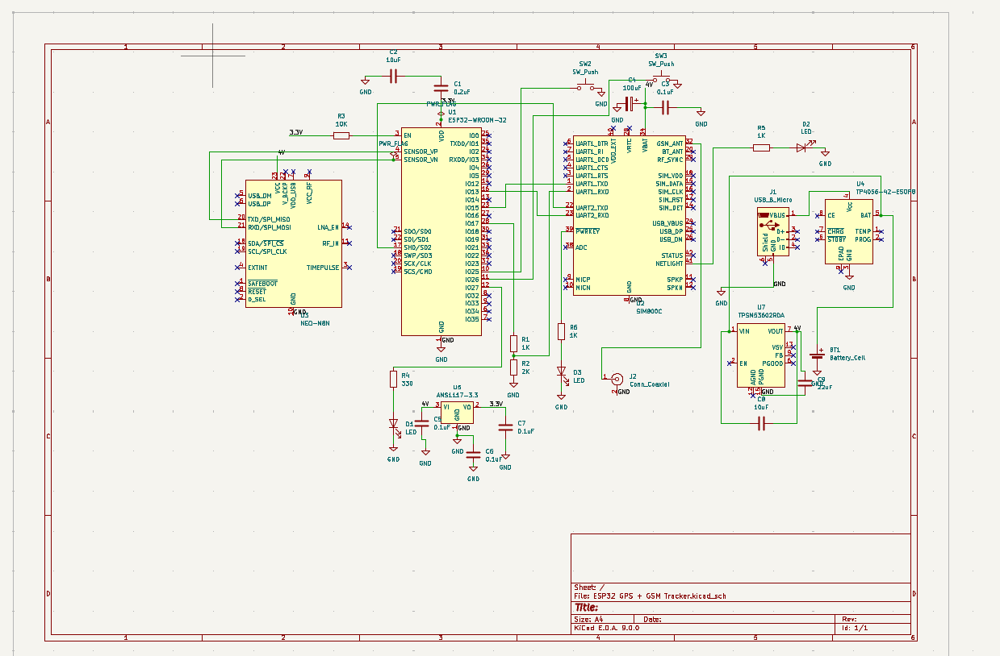
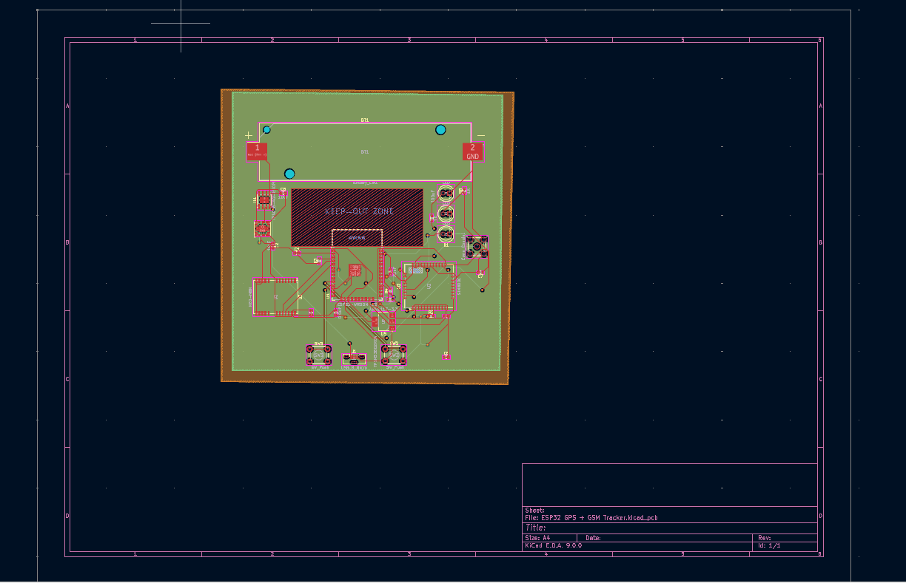
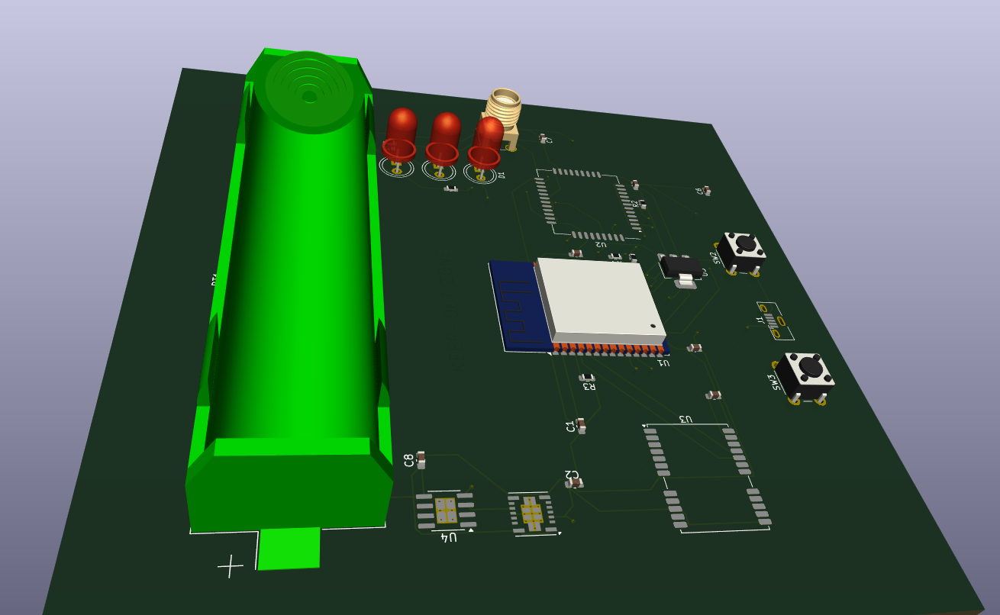

# ESP32 GPS + GSM Tracker

A compact IoT tracking device based on an ESP32-WROOM-32, SIM800C cellular module, and u‑blox NEO‑M8N GPS. It features Li‑ion battery management (TP4056), a regulated 4 V rail (TPSM53602), and a 3.3 V supply (AMS1117) to power the ESP32.

---

## 🖼️ Preview

### 📐 Schematic


### 🧭 PCB Layout


### 🧱 3D Render



---

## 🚀 Features

- **GPS positioning** via NEO‑M8N (UART)  
- **GSM/GPRS connectivity** via SIM800C (UART)  
- Li‑ion **battery charging** with TP4056  
- Stable **4 V buck** for radio modules (TPSM53602)  
- **3.3 V regulator** for ESP32 logic (AMS1117)  
- Push‑buttons for user input (IO25/IO26)  
- Status LED indicators for power & network  
- 4‑layer PCB: Top & bottom for signals, inner planes for GND & 4 V

---

## 📂 Repository Structure
```
├── Gerber Files/ ← Manufacturing outputs
├── Images/
│ ├── 3D.png ← PCB 3D render
│ ├── CKT.png ← Final schematic
│ └── pcb_routing.png ← Routed PCB view
├── PROJECT FILES/
│ ├── ESP32 GPS + GSM Tracker.kicad_pro
│ ├── ESP32 GPS + GSM Tracker.kicad_sch
│ └── ESP32 GPS + GSM Tracker.kicad_pcb
├── README.md ← This file
```


---

## 🔧 Hardware Overview

| Module      | Part / Footprint                 | Capacitors            |
|-------------|----------------------------------|-----------------------|
| **ESP32**   | `Module:ESP32-WROOM-32`          | 0.1 µF + 10 µF on VDD  |
| **SIM800C** | `RF_Module:SIM800C`              | 0.1 µF + 100 µF on VBAT|
| **NEO‑M8N** | `RF_Module:UBlox_NEO-M8N`        | 0.1 µF + 1 µF on VCC   |
| **TP4056**  | `Package_SO:SOIC-8`               | 1 µF IN/1 µF OUT      |
| **TPSM53602**| `Texas:TPSM53602RDA`            | 10 µF IN/22 µF OUT    |
| **AMS1117** | `Package_TO_SOT_SMD:SOT-223`     | 10 µF IN/10 µF OUT    |

---

## 🔌 Pin Wiring Summary

- **SIM800C (U2)**  
  - VBAT → 4 V rail  
  - UART1_TXD → ESP32 IO16  
  - UART1_RXD ← ESP32 IO17 (via 1 k+2 k divider)  
- **NEO‑M8N (U3)**  
  - VCC → 4 V rail  
  - TX → ESP32 IO4  
  - RX ← ESP32 IO5  
- **ESP32 (U1)**  
  - VDD → 3.3 V regulator  
  - EN → 3.3 V via 10 kΩ pull‑up  
  - IO25, IO26 → SW1, SW2  
  - IO27 → Status LED  

---

## 🛠️ Build & PCB Layout

1. **Open KiCad project**:  
   ```bash
   cd "PROJECT FILES"
   kicad ESP32\ GPS\ +\ GSM\ Tracker.kicad_pro
   
2. Review ERC, assign footprints, then update PCB.

3. Fill zones:
   Layer 2 → GND
   Layer 3 → 4 V

4. Route critical nets on Top, overflow on Bottom.

5. Generate Gerbers via:
```File → Plot```  and  ```Fabrication Outputs → Generate Drill Files```

📋 License
This project is released under the MIT License.

Built by Sharanya — a portable, battery‑powered GPS/GSM tracker ready for IoT deployments!

